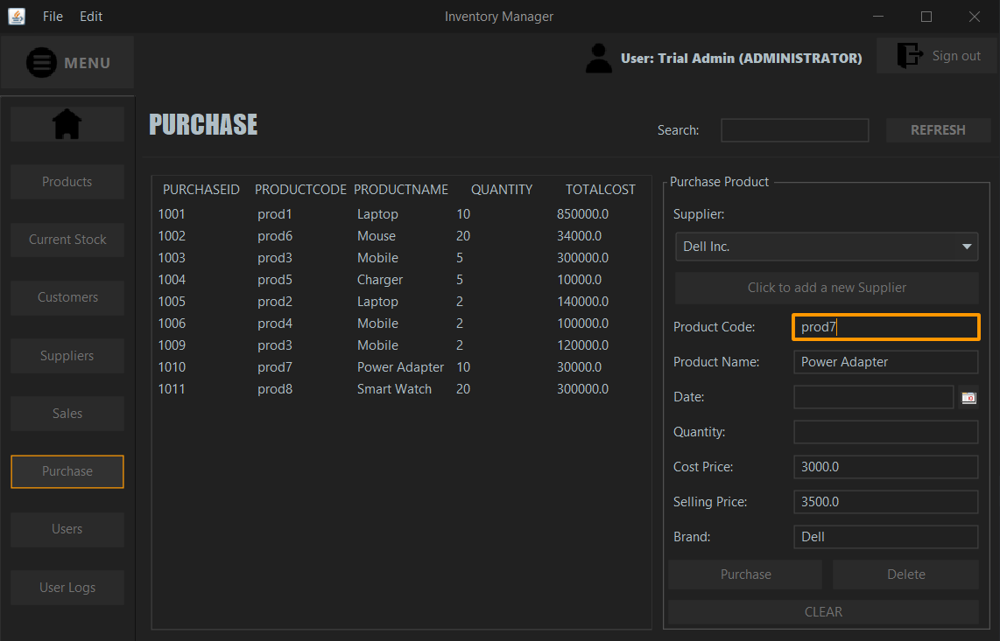

# 🛍️ Inventory Management System  

An **Inventory Management System** designed as a **desktop application** using ***Java*** and ***MySQL***.  

This system helps small to mid-sized businesses efficiently manage their inventory, sales, and transactions.  

## 🚀 Overview  
This application allows businesses to keep track of:  
✅ Products  
✅ Customers  
✅ Suppliers  
✅ Users  
✅ Transactions  

## ✨ Features  
- 📦 **Inventory & Stock Management** – Easily track available stock and update product details.  
- 💰 **Sales & Purchases** – Manage transactions seamlessly with automatic stock updates.  
- 👥 **User Roles**:  
  - **Administrator** – Full access, including user management.  
  - **Employee** – Restricted access, mainly for handling inventory and transactions.  
- 🔍 **Search Functionality** – Quickly find records in all sections.  
- ⚡ **Simplified Sales Process** – Just enter the product code, and all relevant details are fetched automatically.  
- 🕒 **User Logs** – Track login/logout times for security and monitoring.  

## 🛠️ Installation & Setup  
### Prerequisites  
- **Java** (JDK or JRE version **16** or higher).  

### Steps to Run  
1️⃣ **Download & Extract** the ZIP file: [InventoryManagement.zip](InventoryManagement.zip)  
2️⃣ **Setup the Database**:  
   - Download the SQL dump file: [SQL/InventoryDB.sql](SQL/InventoryDB.sql)  
   - Import it using **MySQL Workbench** to create the required database schema.  
3️⃣ **Run the Application**:  
   - Execute the `InventoryManagement.jar` file from the extracted folder.  
4️⃣ **Database Connection**:  
   - Default credentials:  
     - **Username:** root  
     - **Password:** root  
   - To update database credentials:  
     1. Open the `lib` folder.  
     2. Edit the `DBCredentials.xml` file.  
     3. Change the username and password inside:  
     ```xml
     <properties>
       <comment>Database Credentials</comment>
       <entry key="username">your_username</entry>
       <entry key="password">your_password</entry>
     </properties>
     ```
5️⃣ **Login Credentials**:  
   - **Username:** root  
   - **Password:** root  

## 🖥️ Application Screenshots  
### 🔐 Login Page  
  

### 📊 Dashboard  
  

### 📦 Inventory Management  
- **Products**  
    
- **Stock Availability**  
    
- **Suppliers**  
    
- **Customers**  
    

### 💳 Transactions  
- **Sales**  
    
- **Purchases**  
    

### 🔑 User Management (Admin Only)  
- **Users**  
    
- **User Logs**  
    

## 🏗️ Technologies Used  
🖥️ **Java** (JDK 16)  
🔗 **JDBC API** (for database connectivity)  
💾 **MySQL** (Database)  
📌 **IntelliJ IDEA / NetBeans** (Development)  
🛢️ **MySQL Workbench** (Database Management)  

## 🗂️ Database Schema (ER Diagram)  
  

## 📁 Code Structure  
The project is structured into four key modules:  
1️⃣ **Data Access Object (DAO)** – Handles direct database interactions.  
2️⃣ **Data Transfer Object (DTO)** – Transfers data between different parts of the system.  
3️⃣ **Database** – Manages database connections and authentication.  
4️⃣ **User Interface (UI)** – Contains all screens and user interactions.  

[📌 Click here to view the source code](src/com/inventory/)  

## 🚧 Future Enhancements  
⚙️ **Adding analytics and reporting features** 📊  
📱 **Building a mobile-friendly version** 📱  
🌍 **Cloud database integration** ☁️  

This project is actively being improved with new features! 🎯🚀
