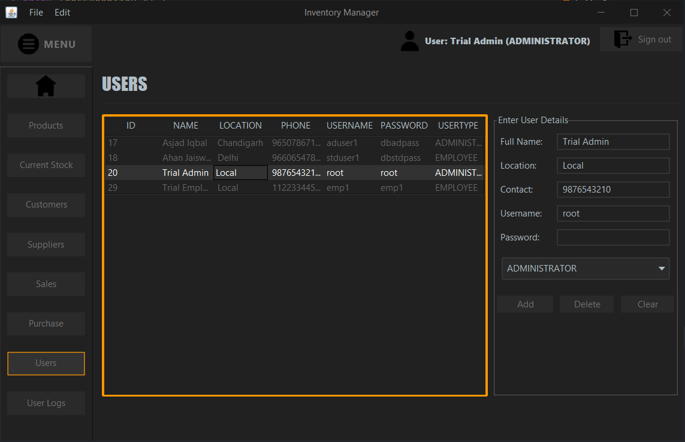

# Inventory_Management_System
# Inventory Management System

An **Inventory Management System** designed as a **GUI desktop application** using ***Java*** and ***MySQL*** as the database.

The GUI is built with **Swing**, and database connectivity is handled using the **JDBC API**.

## Overview
This application helps small to mid-sized businesses manage their:
- Products
- Customers
- Suppliers
- Users
- Transactions

## Features
- Manage inventory and stock of all products.
- Track sales and purchase transactions efficiently.
- Supports two user roles:
  1. **Administrator** – Full access to all functionalities, including user management.
  2. **Employee** – Limited access, primarily for handling inventory and transactions.
- Automatic stock updates after each transaction.
- Search functionality for quick access to records.
- Simplified sales process—users only need to enter the product code.
- Logs user activity, including login and logout times.

## Installation & Setup
### Prerequisites
- JDK or JRE version **16** or higher.

### Steps to Run
1. **Download and extract the ZIP folder**: [InventoryManagement.zip](InventoryManagement.zip)
2. **Setup the database**:
   - Download the SQL dump file: [SQL/InventoryDB.sql](SQL/InventoryDB.sql)
   - Import the dump file using MySQL Workbench to create the required schema and tables.
3. **Run the application**:
   - Execute the JAR file (`InventoryManagement.jar`) from the extracted folder.
4. **Database Connection**
   - Default credentials:
     - **Username:** root
     - **Password:** root
   - To update database credentials:
     1. Navigate to the `lib` folder.
     2. Open `DBCredentials.xml`.
     3. Modify the `<entry key="username">` and `<entry key="password">` values.
     ```xml
     <properties>
       <comment>Database Credentials</comment>
       <entry key="username">root</entry>
       <entry key="password">root</entry>
     </properties>
     ```
5. **Login Credentials**
   - **Username:** root
   - **Password:** root

## Application Screenshots
### Login Page


### Dashboard


### Inventory Management
- **Products**
  
- **Stock Availability**
  
- **Suppliers**
  
- **Customers**
  

### Transactions
- **Sales**
  
- **Purchases**
  

### User Management (Admin Only)
- **Users**
  
- **User Logs**
  

## Technologies Used
- **Java** (JDK 16)
- **JDBC API** (Database connectivity)
- **MySQL** (Database)
- **JetBrains IntelliJ IDE** / **Apache NetBeans IDE** (Development)
- **MySQL Workbench** (Database management)

## Database Schema (ER Diagram)


## Code Structure
The source code is structured into four main packages:
1. **Data Access Object (DAO)** – Handles direct database interactions.
2. **Data Transfer Object (DTO)** – Transfers data between layers.
3. **Database** – Manages database connections and authentication.
4. **User Interface (UI)** – Contains all GUI components.

[Click here](src/com/inventory/) to view the source code.

## Future Enhancements
This project is under active development, with more features and improvements planned in upcoming versions.

